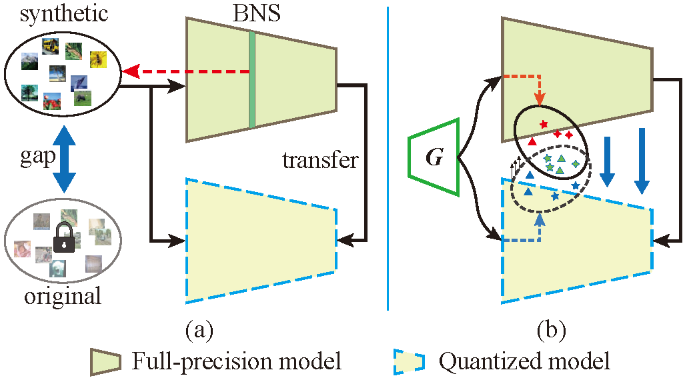
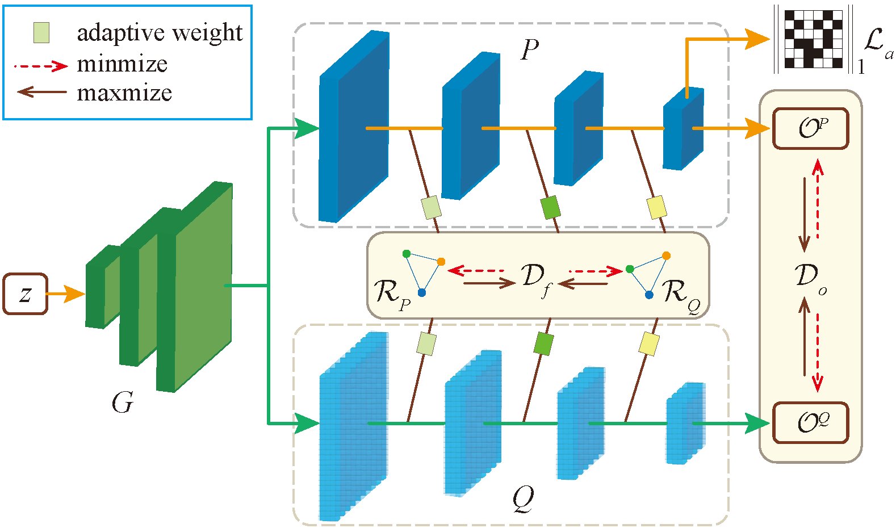

# Zero-shot Adversarial Quantization (ZAQ)

[[paper]](https://arxiv.org/pdf/2103.15263.pdf) accepted as Oral by **CVPR 2021**. 

Author: Yuang Liu, Wei Zhang, Jun Wang

East China Normal University (ECNU)

## Intro

<div align="center">  

<br>
<div style="color:orange; border-bottom: 1px solid #d9d9d9;
display: inline-block;
color: #999;
padding: 2px;">Figure 1. Overview. (a) previous methods; (b) ours.</div>
</div>

To address the quantization issue without data, we propose a zero-shot adversarial quantization (ZAQ) framework, facilitating effective discrepancy estimation and knowledge transfer from a full-precision model to its quantized model. This is achieved by a novel two-level discrepancy modeling to drive a generator to synthesize informative and diverse data examples to optimize the quantized model in an adversarial learning fashion.


<div align="center">   

<br>
<div style="color:orange; border-bottom: 1px solid #d9d9d9;
display: inline-block;
color: #999;
padding: 2px;">Figure 2. ZAQ framework</div>
</div>


## Requirements

- python>=3.6
- torch>=1.2
- torchvision
- visdom
- numpy
- pillow
- scikit-learn


## Usage

To obtain a full-precision model, please refer [train.py](./train.py).

QAT on original dataset:

```bash
python quantize.py --model resnet18 --ckpt 'path/' --data_root './data/' --weight_bit 6 --activation_bit 8
```

Zero-shot quantization without data:

```bash
python main.py --model resnet18 --ckpt 'path/' --data_root './data/' --weight_bit 6 --activation_bit 8 
```

## Todo

- [ ] Segmentation networks
- [ ] Object detection networks
- [ ] Quantization supported by `PyTorch >= 1.7`
- [ ] Mixed-/Arbitrary- precision quantization

Note: This code is temporarily for reference and we will upload a improved version in the future.

## Citation

```bash
@InProceedings{yuang2021zaq,
    tilte = {Zero-shot Adversarial Quantization},
    author = {Liu, Yuang and Zhang, Wei and Wang, Jun},
    booktitle = {Proceedings of the IEEE Conference on Computer Vision and Pattern Recognition (CVPR)},
    month = {June},
    year = {2021}
}
```
